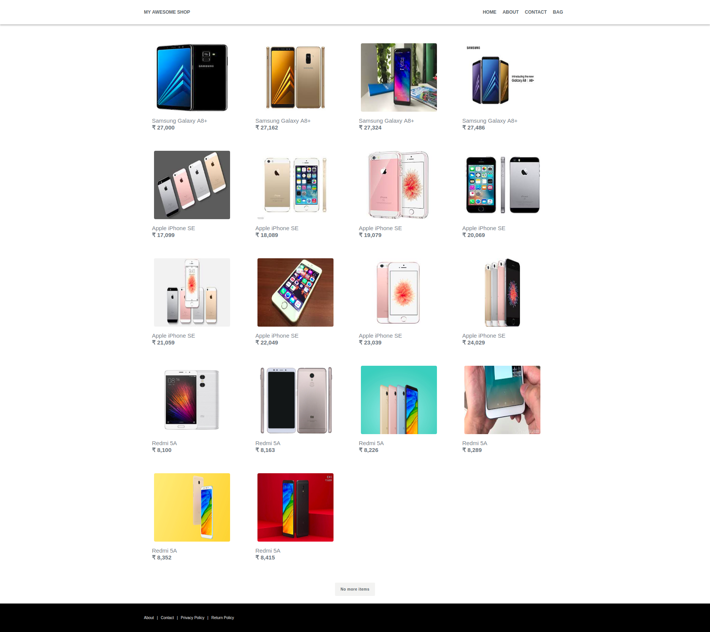
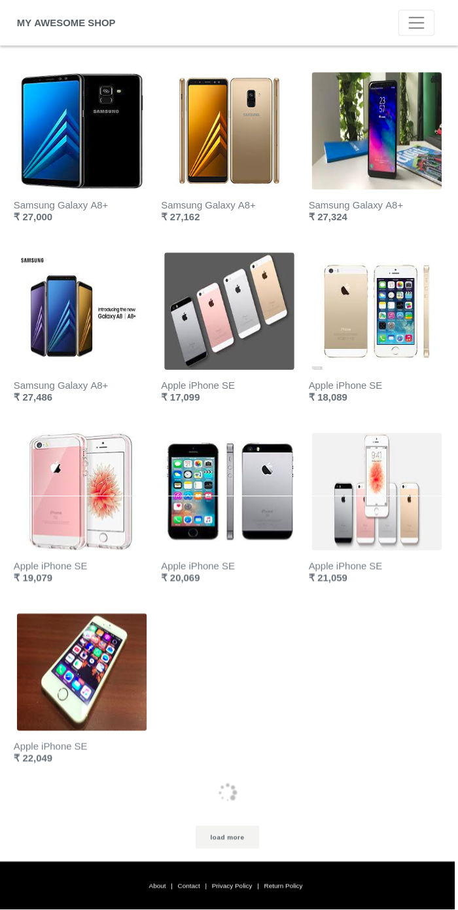
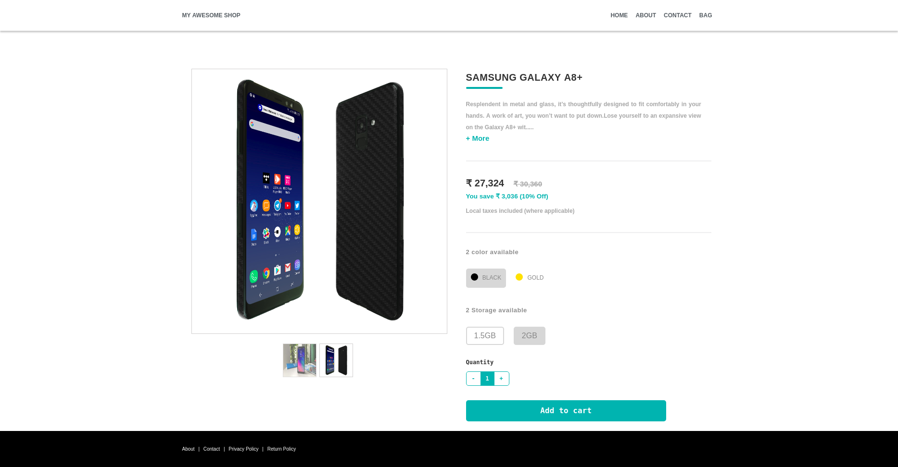
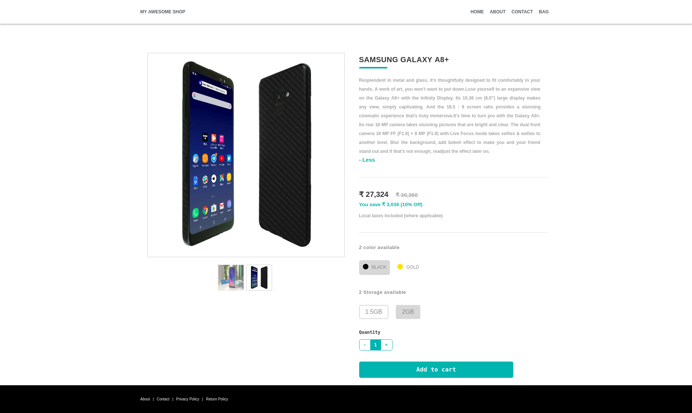
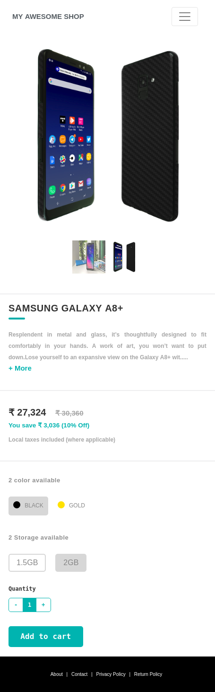

# AppStreet-Assignment
Repo for App Street Assignment

## I have used following tech stack
 `HTML`
 `CSS`
 `BOOTSTRAP`
 `PHP`
 `JS/JQuery`

## Deployment Link on Heroku

## Snapshots of App views
### Desktop View
  
  
  
  

### Mobile View
  
  
  
